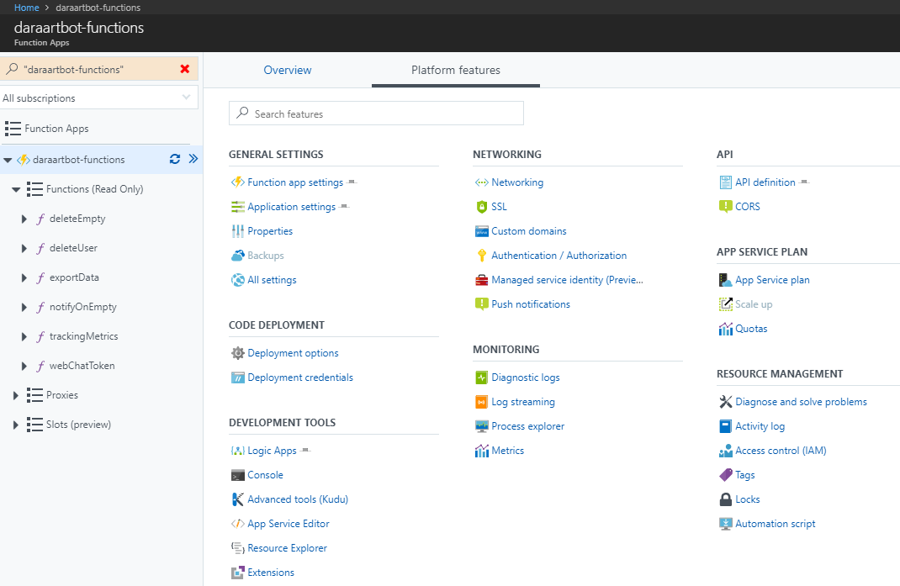
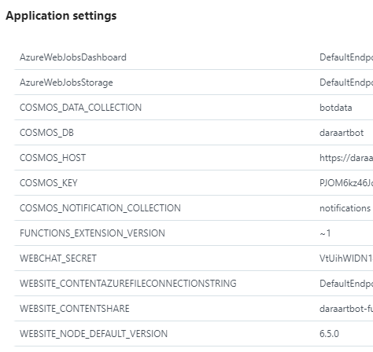

# Securing token generation from Botframework

The webchat build son Azure's [Direct Line API](https://docs.microsoft.com/en-us/azure/bot-service/rest-api/bot-framework-rest-direct-line-3-0-concepts?view=azure-bot-service-3.0). Each session/user needs to be authorised via tokens to be able to connect to and chat with your bot. The Direct Line API provides a simple mechanism for generating user tokens. See example below:

```js
request.post('https://directline.botframework.com/v3/directline/tokens/generate', {
        'auth': {
            'bearer': YOUR_DIRECT_LINE_SECRET
        }
        }, (err, res, body) => {
            // token is in body
            body = JSON.parse(body);
            console.log(err,res.statusCode,body);
        });
```

However, as seen in the code sample, the API needs a secret specific to your bot. As a result, you ~cannot~ **should not** use this directly from your website. In this section you will learn how to get the tokens securely by leveraging another Azure service - [Azure Functions](https://docs.microsoft.com/en-us/azure/azure-functions/functions-overview).

# Backend - Azure Functions API to generate tokens

This code sample uses the HTTP Trigger functionality of Azure Functions. If not already familiar with it, you should go build a [simple test function](https://docs.microsoft.com/en-us/azure/azure-functions/functions-create-first-azure-function) to understand how that works. 

## What does the code do?

- This function is merely a proxy in front of the Direct Line API so that your secret is not exposed.
- You can add additional features like throttling and API key based access control via the Azure Functions Dashboard.
- You can log requests by user id to create an audit trail
- 


## Notes

- Your Azure Functions App, like all serverless options, will cold-start if not invoked regularly. This can add 10 seconds or more of delay in the token generation. In this case, you may want to create a scheduled trigger that keeps your function "warm". Alternatively, you could use a hosted server instead of a serverless framework.

- Azure Functions supports continuous deployment via integrations with e.g. Github/Bitbucket. You should almost certainly use this to minimise devops effort as well as version mismatches.

- It is best practise to read secrets from environment variables rather than files. You can add environment variables under Application Settings in the Azure Functions Dashboard.



# Frontend - Generate tokens asynchronously

This code is pretty straightforward - we replace a call to the Direct Line API with a call to our functions API. There are additional steps in storing the token so that you can reuse it before expiry that are covered in the section - [Remember the User](../user_experience/remember_user/README.md).