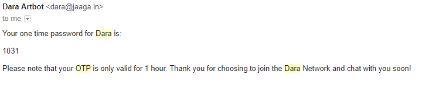

# Sign up and Sign in within Chat

When deploying the Web Chat in lieu of e.g. FB Messenger, it is important to handle the following two scenarios. 

- Scenario 1 - A new user starts a web chat session and wants to sign up.
    - You should, ideally, provide means of signing up from within the chat flow.
- Scenario 2 - A user has signed up and starts a new web chat session, perhaps on a new device
    - You should, ideally, authenticate the user from within the chat flow.

Most solutions to these scenarios ask the user to interact with a login flow outside the chat window, usually by 1 of the following methods:
1. Present a login link within the chat window and ask the user to click and conclude the signup/sign-in process.
2. Include a sign in flow on the webpage before even showing the chat window.

We feel there's a better way that reduces friction for the user and dropout rates for you. Read on to implement this within your bot.

# Backend Code for the Bot
The method we are going to use relies on email + OTP (one time password) to authenticate the user. There are 3 key features that we implement in the accompanying code:
1. We prompt for the email early in the chat session and send them an OTP. We store the OTP in the newly created userData object within botData.
    - We use NodeMailer to handle the email sending via Gmail to be certain that the mail will end up in their primary inbox. Given [Gmail's daily sending limits](https://support.google.com/a/answer/166852?hl=en), you may want to replace this with a bulk mailer like Amazon SES if your bot is very popular.
2. We allow the user to engage with the bot **without** first confirming the OTP. The user can later type in the 4 digit OTP at _any_ time and we verify their account. This can help greatly reduce dropouts.
3. If you wish, you can include an expiry time for the OTP. If using an expiry time, you will want to prompt the user for their OTP before the expiry or change the flow above so that you wait on OTP confirmation before letting them continue with the session.

## Sample Email

_Sample email sent by NodeMailer_

# Frontend Code
None! That's the whole point :-).